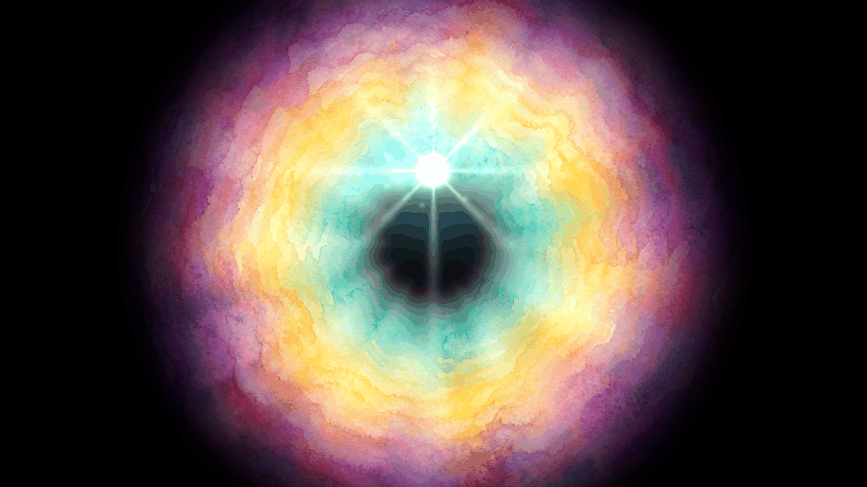

# soulhalo — parallaxe circulaire, halo multicolore et sphère-âme

Reproduction du visuel de référence : un **halo multicolore circulaire** en
parallaxe, traversé par une **sphère lumineuse — l'âme du joueur — qui
voyage** le long d'une orbite.



## Ce qu'est la parallaxe ici

Une parallaxe ordinaire fait glisser des plans horizontalement à des vitesses
différentes. Ici les plans sont des **couronnes concentriques**, et c'est leur
**vitesse angulaire** qui diffère :

| Couronne | Rayon | Vitesse (tours/boucle) | Lecture |
|---|---|---|---|
| 1 | 1.30 | **+1** | bord, lointain |
| 2 | 1.00 | **−2** | |
| 3 | 0.78 | **+3** | |
| 4 | 0.60 | **−4** | |
| 5 | 0.44 | **+6** | |
| 6 | 0.28 | **−8** | cœur, proche |

Deux règles produisent la profondeur :

- la vitesse **croît vers le centre** — on regarde dans un tunnel, pas sur une
  image plate ;
- les sens **alternent** — le cisaillement entre couronnes voisines est ce qui
  rend le mouvement lisible.

## Le bouclage, par construction

Toutes les vitesses sont des **entiers** en tours par boucle, et chaque terme
de respiration s'écrit `cos(2π·k·phase)` avec `k` entier. La dernière frame se
raccorde donc à la première **au bit près** — pas approximativement.

```python
np.array_equal(r.render(0.0), r.render(1.0))   # True
```

C'est vérifié par `test_boucle_exacte`, et `test_parallaxe_les_couches_ne_bougent_pas_ensemble`
interdit qu'une vitesse redevienne fractionnaire par mégarde.

## La plaque peinte → bande polaire

Le fond n'est pas dessiné au code : c'est une **plaque aquarelle carrée**
produite par le générateur d'images (`research/plates/plate_nebula.png`),
échantillonnée sur des **cercles complets** pour donner une bande polaire
`(rayon, angle, RGB)`.

Une ligne de cette bande = un cercle concentrique. Comme l'échantillonnage
parcourt des tours entiers, la bande est **cycliquement continue en θ** : la
rotation ne peut pas créer de couture, quelle que soit la vitesse.

Conséquence pratique : **changer d'ambiance = changer de plaque**, sans
toucher au code.

## L'âme

Orbite **elliptique** (`ry < rx`) — l'écrasement vertical fait lire une
perspective plutôt qu'un cercle à plat. La sphère porte une traînée
exponentielle de 26 échantillons pris à des phases **antérieures**, un noyau,
un halo, des branches d'étoile et des étincelles orbitales à fréquence entière.

## Utilisation

```bash
.venv/bin/python -m soulhalo.cli --width 960 --height 540 --frames 48 --sheet
```

| Option | Effet | Défaut |
|---|---|---|
| `--plate` | plaque aquarelle source | `research/plates/plate_nebula.png` |
| `--frames` / `--fps` | longueur et vitesse de la boucle | 48 / 20 |
| `--speed` | multiplie les vitesses (réarrondies à l'entier) | 1.0 |
| `--orbit` / `--tilt` | rayon et écrasement de l'orbite | 0.46 / 0.65 |
| `--orbit-turns` | tours d'orbite par boucle (entier) | 1 |
| `--soul` / `--trail` | taille du noyau, longueur de traînée | 0.085 / 26 |
| `--saturation` | ravive les teintes | 1.85 |
| `--grain` / `--bloom` | grain de papier, voile lumineux | 0.030 / 0.30 |
| `--sheet` | planche contact | — |

## Deux pièges rencontrés

**L'addition de six couches colorées vire au blanc.** Sommer les couronnes
délavait tout. Elles sont maintenant fusionnées en **moyenne pondérée** (la
couleur est préservée) et seule la **densité cumulée** règle l'intensité.

**`smoothstep` avec bornes décroissantes.** Une vignette s'écrit
`smoothstep(1.34, 0.70, r)`. Un garde-fou `max(1e-6, e1-e0)` écrasait l'écart
négatif et rendait l'image entièrement noire au centre. Le garde-fou porte
désormais sur la **valeur absolue**.

## Tests

```bash
.venv/bin/python -m pytest tests/test_soulhalo.py -q     # 19 tests
```

Couvrent : bouclage exact et repli de phase, continuité cyclique de la bande,
vitesses entières et ordonnées, absence d'à-coup (l'écart maximal entre frames
voisines reste sous 2,4× la moyenne), orbite réellement parcourue et
elliptique, halo non délavé, fond noir aux bords, âme = point le plus
brillant, déterminisme et grain non scintillant.
